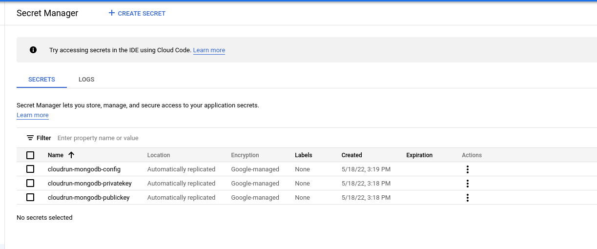
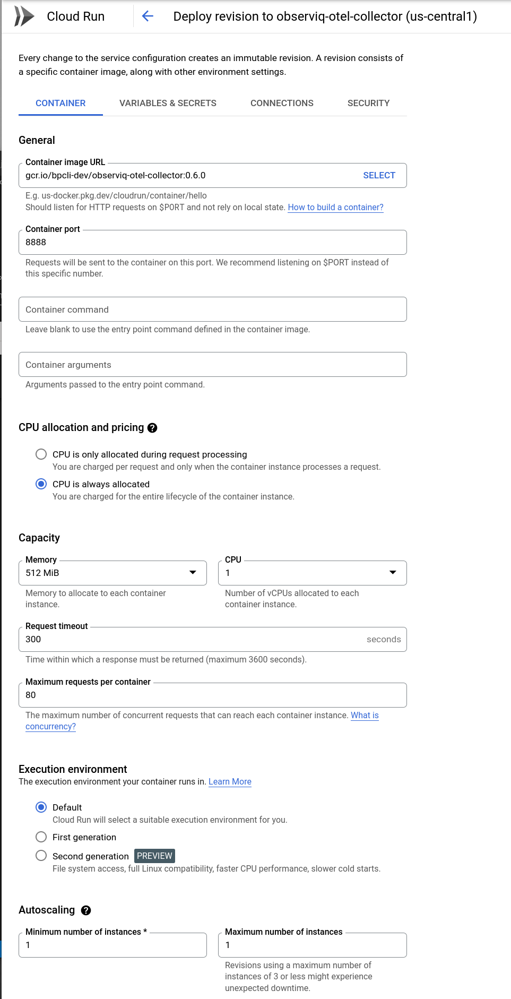
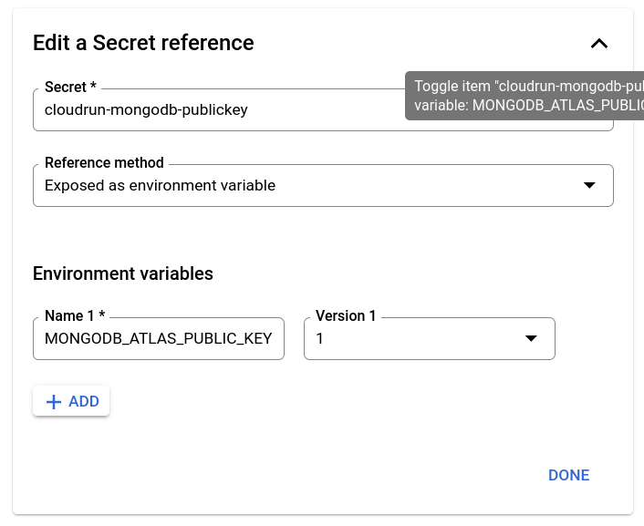
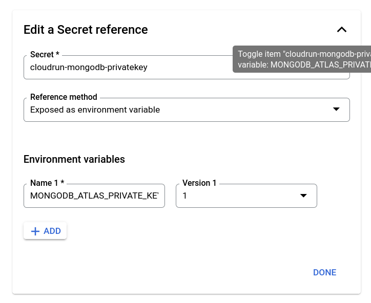
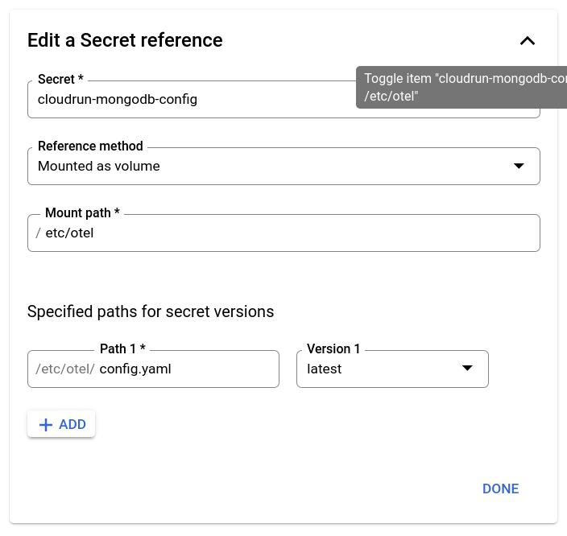

## Cloud Run

The collector can be deployed with [Google Cloud Run](https://cloud.google.com/run).

## Image

Push the collector image to your GCR account:
- replace `1.1.0` with your desired version
- replace `myproject` with your gcr project

```bash
docker pull observiq/observiq-otel-collector:1.1.0
docker tag observiq/observiq-otel-collector:1.1.0 gcr.io/myproject/observiq-otel-collector:1.1.0
docker push gcr.io/myproject/observiq-otel-collector:1.1.0
```

## Deployment

Follow the steps in [Image](./google-cloud-run.md#image) before continuing.

**Secrets**

1. Create secret: cloudrun-mongodb-publickey (mongodb atlas public key)
2. Create secret: cloudrun-mongodb-privatekey (mongodb atlas private key)
3. Create secret: cloudrun-mongodb-config  (collector config.yaml, upload as a file)
4. Give the Cloud Run service account "secret accessor" for each secret (from steps 1-3)




**Cloud Run**

1. Create Service.
2. Container Image URL: Image tag pushed in the [build](README.md#build) step.
3. Check "cpu always allocated".
4. Set autoscaling min 1 and max 1.
5. Ingress: Allow internal traffic only.
6. Authentication: Require authentication.
7. Container port: 8888 (collector's metrics port)



8. Secret: Mount `cloudrun-mongodb-publickey` as `MONGODB_ATLAS_PUBLIC_KEY` environment variable.



9. Secret: Mount `cloudrun-mongodb-privatekey` as `MONGODB_ATLAS_PRIVATE_KEY` environment variable.



10. Secret: Mount `cloudrun-mongodb-config` as `/etc/otel/config.yaml` file mount path.



