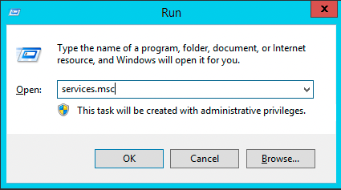
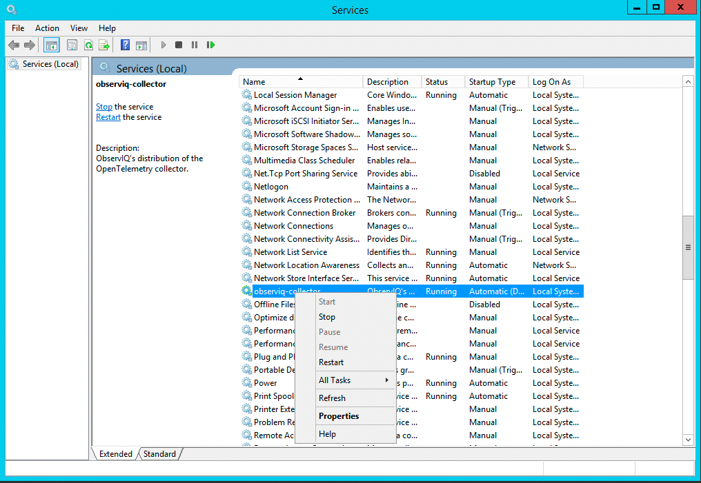
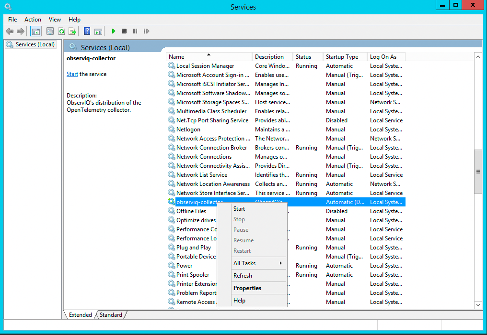
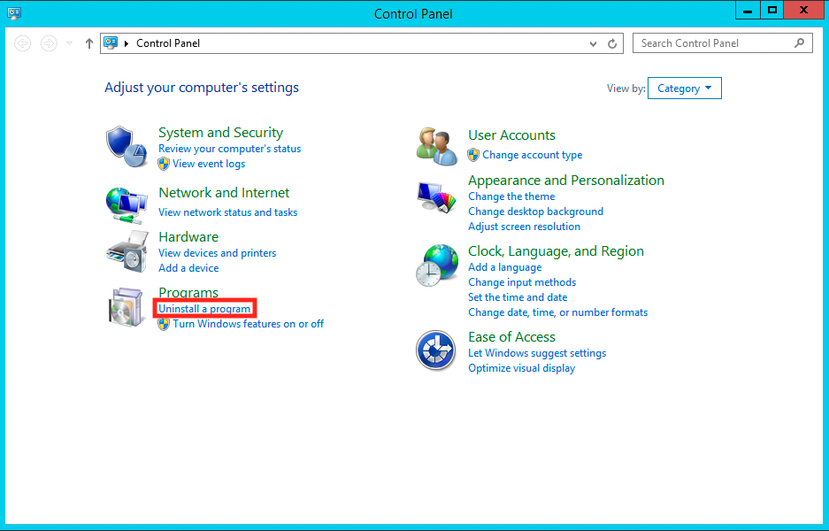
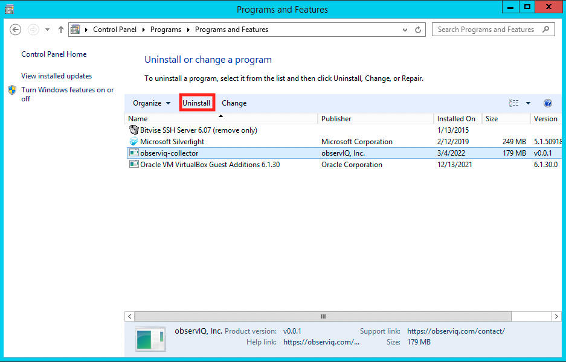

# Windows Installation

## Installing

To install the collector on Windows, first [download the latest MSI](https://github.com/observIQ/observiq-collector/releases/latest).

After downloading the MSI, simply double click it to open the installation wizard. Follow the instructions to configure and install the collector.

Alternatively, you can run the Powershell command below to install the MSI with no UI.
```pwsh
    msiexec /i "<path-to-msi>" /passive
```

## Next Steps

After installing, the `observiq-collector` service will be running and ready for configuration! 

Logs from the collector will appear in the Application event log.

By default, the config file for the collector can be found at `C:\Program Files\observiq-collector\config.yaml`. When changing the configuration, you must restart the collector in order for config changes to take effect.

## Restarting the Collector
Restarting the collector may be done through the services dialog.
To access the services dialog, press Win + R, enter `services.msc` into the Run dialog, and press enter.


Locate the `observiq-collector` service, right click the entry, and click "Restart" to restart the collector.


Alternatively, you may run the Powershell command below.
```pwsh
Restart-Service -Name "observiq-collector"
```

## Stopping the Collector

Stopping the collector may be done through the services dialog.
To access the services dialog, press Win + R, enter `services.msc` into the Run dialog, and press enter.


Locate the `observiq-collector` service, right click the entry, and click "Stop" to stop the collector.


Alternatively, you may run the Powershell command below.
```pwsh
Stop-Service -Name "observiq-collector"
```

## Starting the Collector

Starting the collector may be done through the services dialog.
To access the services dialog, press Win + R, enter `services.msc` into the Run dialog, and press enter.


Locate the `observiq-collector` service, right click the entry, and click "Start" to start the collector.


Alternatively, you may run the Powershell command below.
```pwsh
Start-Service -Name "observiq-collector"
```

## Uninstalling

To uninstall the collector on Windows, navigate to the control panel, then to the "Uninstall a program" dialog.


Locate the `observiq-collector` entry, and select uninstall. 


Follow the wizard to complete removal of the collector.

Alternatively, you can run the Powershell command below to uninstall the collector.
```pwsh
(Get-WmiObject -Class Win32_Product -Filter "Name = 'observiq-collector'").Uninstall()
```
