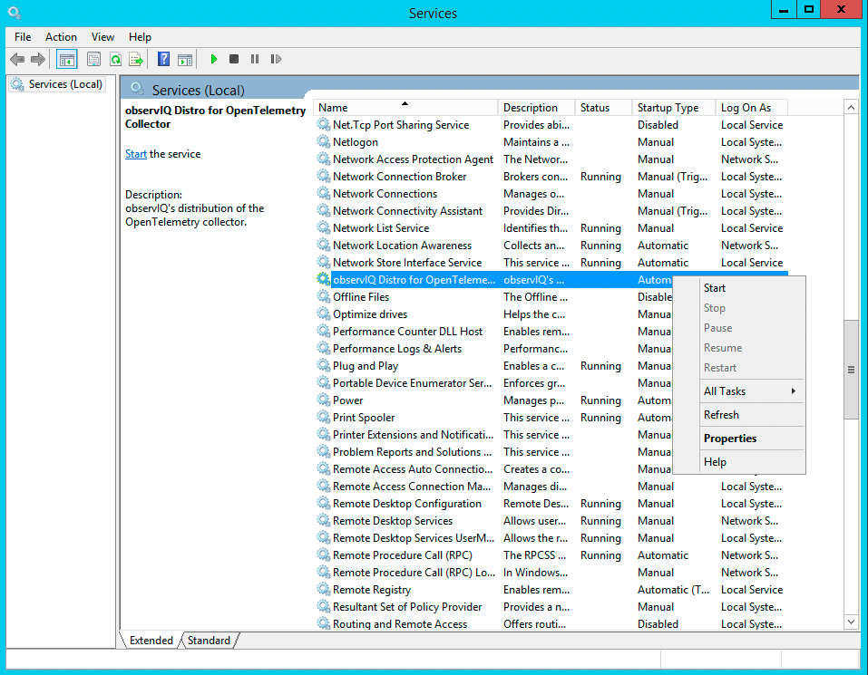

# Windows Installation

## Installing

To install the agent on Windows, start Powershell as an administrator and run the command below to install the MSI with no UI.
```pwsh
msiexec /i "https://github.com/observIQ/bindplane-agent/releases/latest/download/observiq-otel-collector.msi" /quiet
```

Alternately, for an interactive installation [download the latest MSI](https://github.com/observIQ/bindplane-agent/releases/latest).

After downloading the MSI, simply double click it to open the installation wizard. Follow the instructions to configure and install the agent.

Installation artifacts are signed. Information on verifying the signature can be found at [Verifying Artifact Signatures](./verify-signature.md).

### OpAMP Management

To install the agent and connect the supervisor to an OpAMP management platform, set the following flags. 

```sh
msiexec /i "https://github.com/observIQ/bindplane-agent/releases/latest/download/observiq-otel-collector.msi" /quiet ENABLEMANAGEMENT=1 OPAMPENDPOINT=<your_endpoint> OPAMPSECRETKEY=<secret-key>
```

To read more about the generated connection configuration file see [OpAMP docs](./opamp.md).

## Configuring the Agent

After installing, the `observiq-otel-collector` service will be running and ready for configuration!

The agent is ran and managed by the [OpenTelemetry supervisor](https://github.com/open-telemetry/opentelemetry-collector-contrib/tree/main/cmd/opampsupervisor). The supervisor must receive the agent's configuration from an OpAMP management platform, after which it will stop and restart the agent with the new config.

The supervisor remembers the last config it received via OpAMP and always starts rewrites the agent's config file with it when it starts. This means you can't manually edit the agent's config file on disk. The best way to modify the configuration is to send a new one from the OpAMP platform the supervisor is connected to.

The agent configuration file is located at `/opt/observiq-otel-collector/supervisor_storage/effective.yaml`.

For more information on OTel configurations, see the [OpenTelemetry docs](https://opentelemetry.io/docs/collector/configuration/).

**Logging**

The agent logs to `<install_dir>/supervisor_storage/agent.log` (`C:\Program Files\observIQ OpenTelemetry Collector\supervisor_storage\agent.log` by default).

Stderr for the supervisor process can be found at `<install_dir>/log/observiq_collector.err` (`C:\Program Files\observIQ OpenTelemetry Collector\log\observiq_collector.err` by default).

## Restarting the Agent
Restarting the agent may be done through the services dialog.
To access the services dialog, press Win + R, enter `services.msc` into the Run dialog, and press enter.


Locate the "observIQ Distro for OpenTelemetry Collector" service, right click the entry, and click "Restart" to restart the agent.


Alternatively, the Powershell command below may be run to restart the agent service.
```pwsh
Restart-Service -Name "observiq-otel-collector"
```

## Stopping the Agent

Stopping the agent may be done through the services dialog.
To access the services dialog, press Win + R, enter `services.msc` into the Run dialog, and press enter.


Locate the "observIQ Distro for OpenTelemetry Collector" service, right click the entry, and click "Stop" to stop the agent.


Alternatively, the Powershell command below may be run to stop the agent service.
```pwsh
Stop-Service -Name "observiq-otel-collector"
```

## Starting the Agent

Starting the agent may be done through the services dialog.
To access the services dialog, press Win + R, enter `services.msc` into the Run dialog, and press enter.


Locate the "observIQ Distro for OpenTelemetry Collector" service, right click the entry, and click "Start" to start the agent.



Alternatively, the Powershell command below may be run to start the agent service.
```pwsh
Start-Service -Name "observiq-otel-collector"
```

## Uninstalling

To uninstall the agent on Windows, navigate to the control panel, then to the "Uninstall a program" dialog.


Locate the `"observIQ Distro for OpenTelemetry Collector"` entry, and select uninstall. 


Follow the wizard to complete removal of the agent.

Alternatively, Powershell command below may be run to uninstall the agent.
```pwsh
(Get-WmiObject -Class Win32_Product -Filter "Name = 'observIQ Distro for OpenTelemetry Collector'").Uninstall()
```
